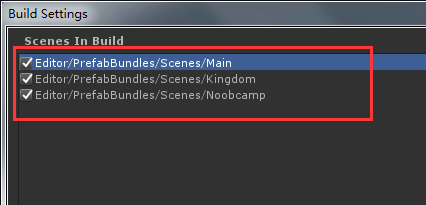

# SUPA

  这是一个小型 U3D 框架项目，仅仅是为了自己做学习笔记。

###   1.为什么会出现这个东西？

  现职的公司，发现好多代码的简直是八仙过海各显神通。况且，项目的框架 Lua 频繁与 C# 交互。根本原因是没有 MVC 或者别的模式来加以限制。模块之间的关系复杂，而且重复代码较多，导致项目很臃肿，后期难以维护。这便是他的缺点。

  优点也有，因为没有太多的限制，上手也非常的快。没有生命周期，没有过多的封装。总而言之，如果你有 U3D 的基础，可以直接上手写代码，只需要简单了解一下项目目录。所以就是开发起来很愉快，至于维护就不予评论。

  明显，这个缺点的问题相对于优点，优点得不偿失。

  上一任的项目的框架经历。简单的说下，那就是太过臃肿，任何的东西都封装的很多层。不过好处就是代码规范，至少不会出现八仙过海。不过也是因为如此，上手起来较为麻烦，你需要了解一整套生命周期，Lua 面向对象的模拟，项目中各种封装的 API。开发起来太多限制，不过维护较为简单。

  所以，SUPA 出现了，仅仅是为了我对上一个项目以及现在项目的理解出现了。

###   2.SUPA 里面有什么？

  首先，倾向于用 Lua 开发，他不会出现太多的 C# 代码，因为我不喜欢 Lua 与 C# 之间有太多的交互。因此，能用 Lua 解决的问题，绝不多写一行 C# 代码。

  资源的管理，倾向于自动化。出包仅仅需要点点鼠标。

  MVC 是必须有的，因为没有人能在自由的环境下不放飞自我。举个例子，当时在荒无人烟的地方，你没有带纸，也没有找到卫生间，你肚子疼了，你会如何？

  面向对象，这是一个好东西，Lua 没有，不过我们可以模拟一个出来，对吧！因此，开发人员不需要太关注底层的实现，可以更好地关注业务层。

  讲了有的东西，该讲讲没有的东西了，稳定、热更、网络通信…… 没有的东西是致命的，所以仅仅学习交流，毕竟只是一份笔记。

### 3.讲了这么多废话，我该如何启动呢？

  如果你把它下载下来，你将会得到一个 Assets

  项目中，有一个名为 Main 的场景文件，将其打开即可，正常运行。

  图 3-1

图 3-1 如果你想要测试场景加载，切换的功能，你需要将所有场景添加至 Scenes In Build 才可以。